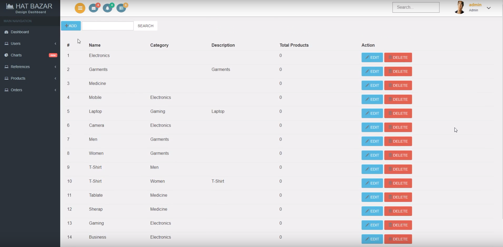
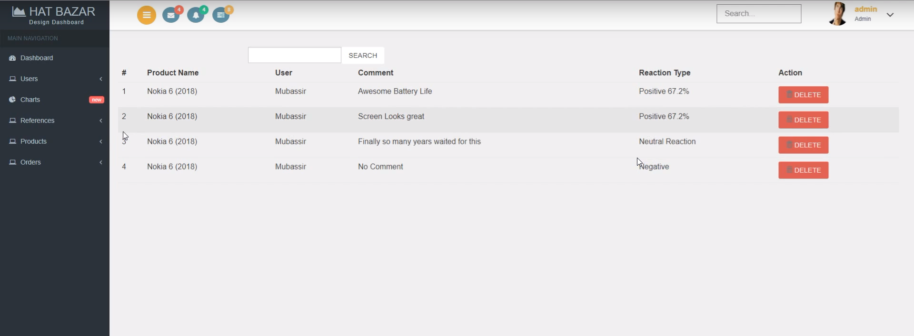
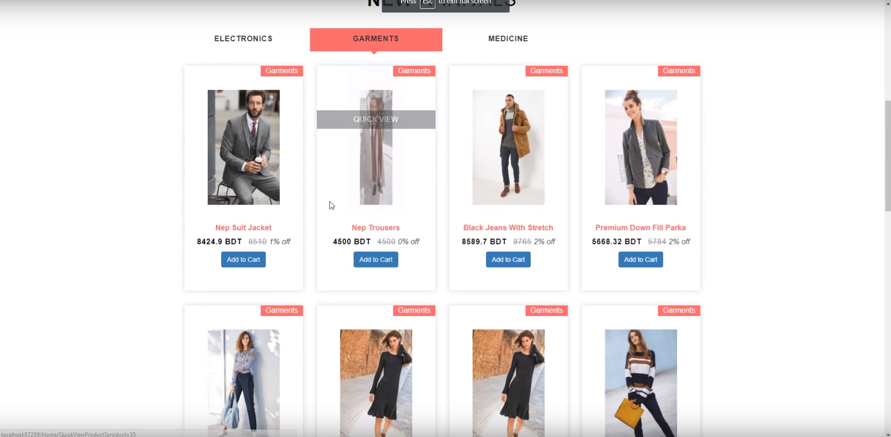
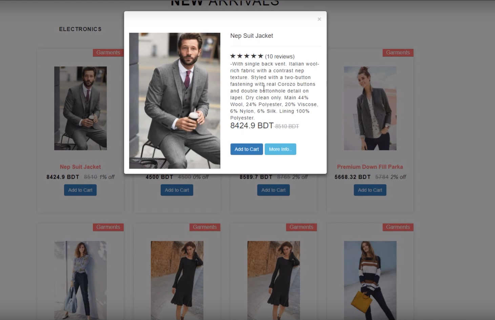
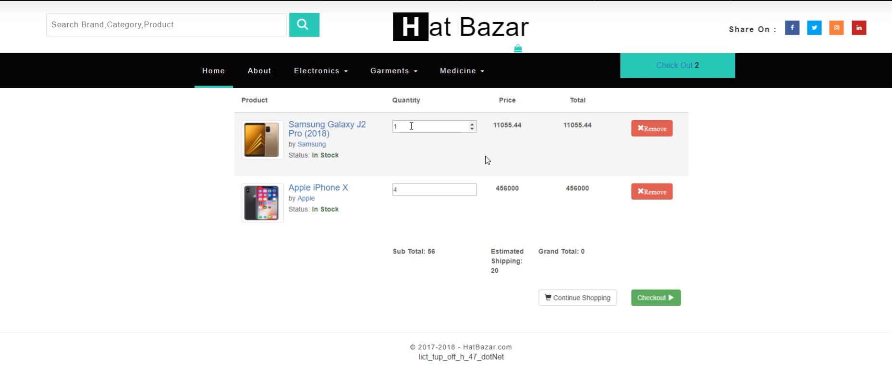
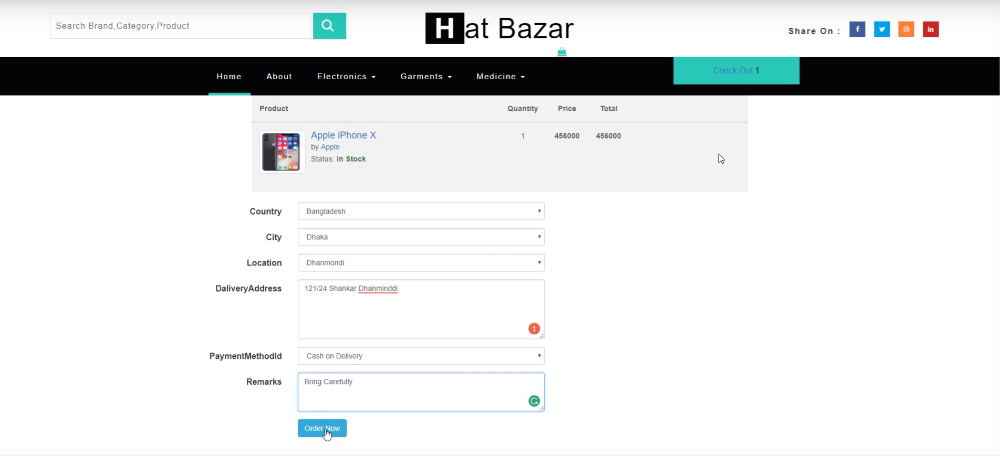
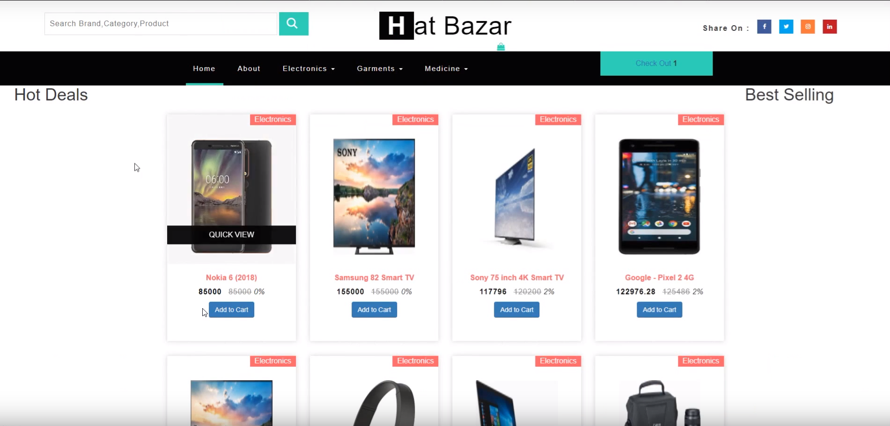
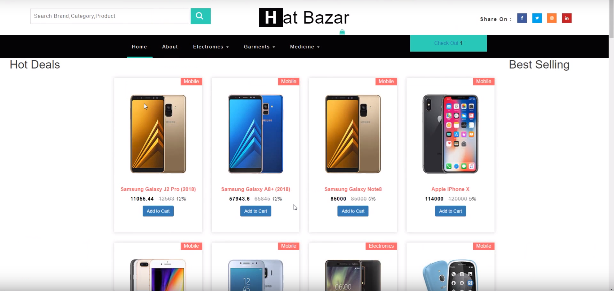

# EcommerceMvc
[Frontend Template/Similar Demo](https://w3layouts.com/elite-shoppy-ecommerce-category-bootstrap-responsive-web-template/)

[How to Setup Project](https://github.com/mubassir-hasan/EcommerceMvc/wiki)

[How to use Code](https://github.com/mubassir-hasan/EcommerceMvc/wiki/How-to-use-Code)

# Demo Pictures
## Admin Panel

## Admin Panel(Comment with Sentiment Analysis)

## Home Page

## Add to cart Popup

## Oreders

## Products

